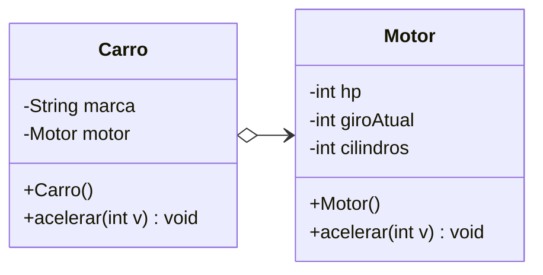

# Modelagem de classes UML com mermaid

## Código java

```java
public class Livro {
    private String Title;
}
```

## Diagrama UML


```mermaid
classDiagram
    direction LR
    class Carro{
        -String marca
        -Motor motor
        +Carro()
        +acelerar(int v) void
    }
    class Motor{
        -int hp
        -int giroAtual
        -int cilindros
        +Motor()
        +acelerar(int v) void
    }
    Carro o--> Motor
```