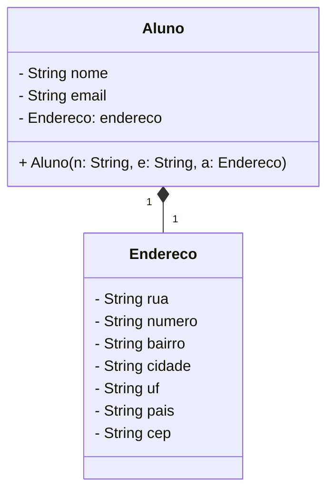
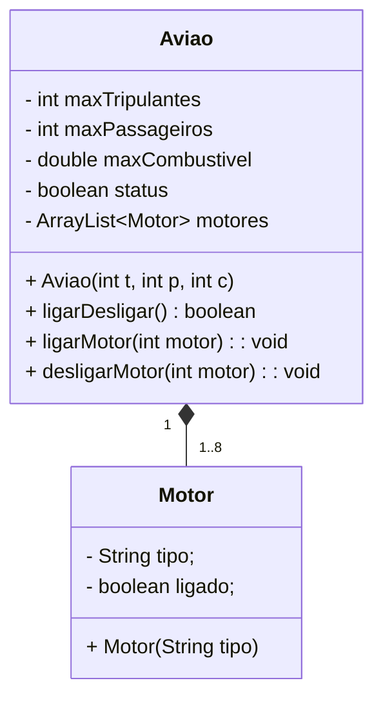

# Diagrama UML - Aluno e endereço

```mermaid
classDiagram

class Aluno{
    - String nome
    - String email
    - Endereco: endereco
    + Aluno(n: String, e: String, a: Endereco)
}

class Endereco{
    - String rua
    - String numero
    - String bairro
    - String cidade
    - String uf
    - String pais
    - String cep
}

Aluno "1"*--"1" Endereco
```

## Exercício 2 - Aviao e motor

```mermaid
classDiagram

    class Aviao{
        - int maxTripulantes
        - int maxPassageiros
        - double maxCombustivel
        - boolean status
        - ArrayList~Motor~ motores
        + Aviao(int t, int p, int c)
        + ligarDesligar() boolean
        + ligarMotor(int motor): void
        + desligarMotor(int motor): void
    }

    class Motor{
        - String tipo;
        - boolean ligado;
        + Motor(String tipo)
    }

Aviao "1"*--"1..8" Motor
```