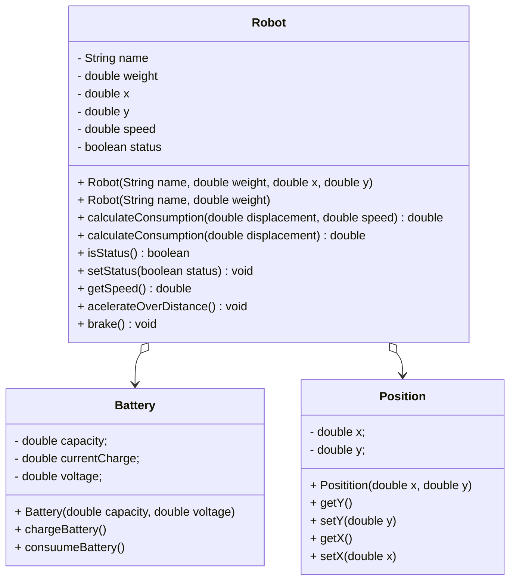

# Implementar classe robô

Bateria = 100

Grid de posições com altura e largura igual a 6.

Consumo por quadrante é 1 / 2L

```mermaid
classDiagram
    class Robot {
        - String name
        - double weight
        - double x
        - double y
        - double speed
        - boolean status
        + Robot(String name, double weight, double x, double y)
        + Robot(String name, double weight)
        + calculateConsumption(double displacement, double speed) double
        + calculateConsumption(double displacement) double
        + isStatus() boolean
        + setStatus(boolean status) void
        + getSpeed() double
        + acelerateOverDistance() void
        + brake() void
    }
    
    class Battery{
        - double capacity;
        - double currentCharge;
        - double voltage;
        + Battery (double capacity, double voltage)
        + chargeBattery()
        + consuumeBattery()
    }
    
    class Position{
        - double x;
        - double y;
        + Positition(double x, double y)
        + getY()
        + setY(double y)
        + getX()
        + setX(double x)        
    }
    Robot o--> Battery
    Robot o--> Position
```