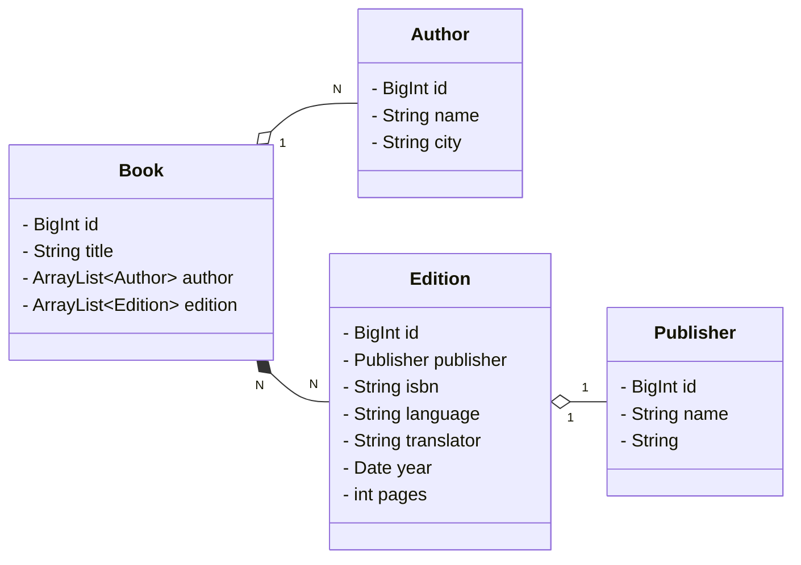
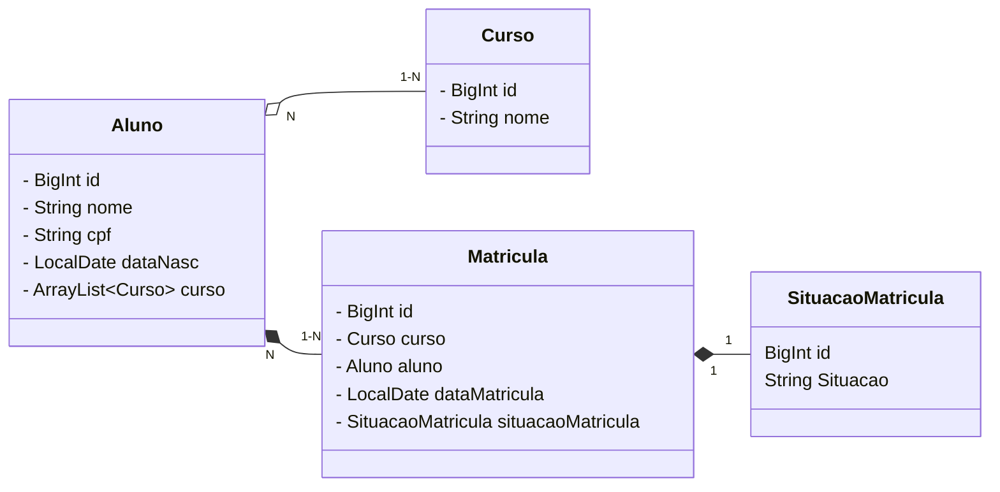

# Modelagem de entidades relacionais

## Modelagem da entidade livro, autor, edição e editora

```mermaid
classDiagram
    direction LR
    
    class Book{
        - BigInt id
        - String title
        - ArrayList~Author~ author
        - ArrayList~Edition~ edition
    }
    class Author{
        - BigInt id
        - String name
        - String city
    }
    class Publisher{
        - BigInt id
        - String name
        - String 
    }
    class Edition{
        - BigInt id
        - Publisher publisher
        - String isbn
        - String language
        - String translator
        - Date year
        - int pages
    }
    Book "1" o-- "N" Author
    Book "N" *-- "N" Edition
    Edition "1" o-- "1" Publisher
```

## Modelagem entidade aluno

```mermaid
classDiagram
    direction LR
    
    class Aluno{
        - BigInt id
        - String nome
        - String cpf
        - LocalDate dataNasc
        - ArrayList~Curso~ curso
    }
    class Curso{
        - BigInt id
        - String nome
    }
    class Matricula{
        - BigInt id
        - Curso curso
        - Aluno aluno
        - LocalDate dataMatricula
        - SituacaoMatricula situacaoMatricula
    }
    class SituacaoMatricula{
        BigInt id
        String Situacao
    }
    Aluno "N" o-- "1-N" Curso
    Aluno "N" *-- "1-N" Matricula
    Matricula "1" *-- "1" SituacaoMatricula
    
```