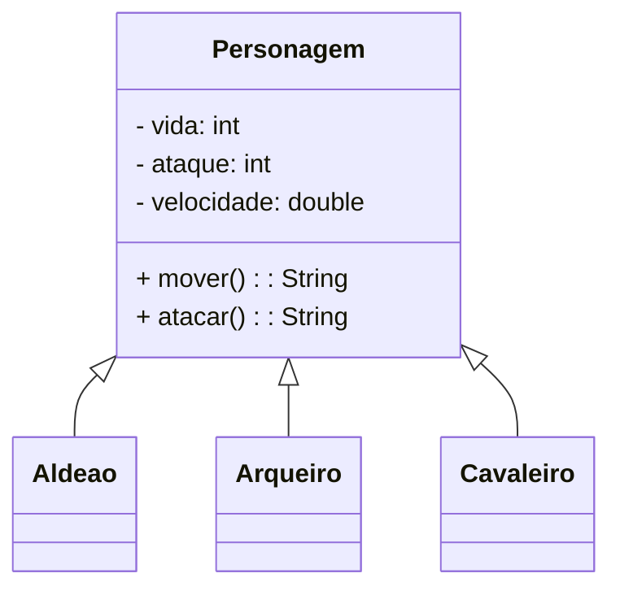

# Java of Empires

```mermaid

classDiagram
    Direction LR
    
    class Personagem {
        - vida: int
        - ataque: int
        - velocidade: double
        + mover(): String
        + atacar(): String
    }
    class Aldeao {
    }
    class Arqueiro {
    }
    class Cavaleiro {
    }

    Personagem |>-- Aldeao
    Personagem |>-- Arqueiro
    Personagem |>-- Cavaleiro
    
```