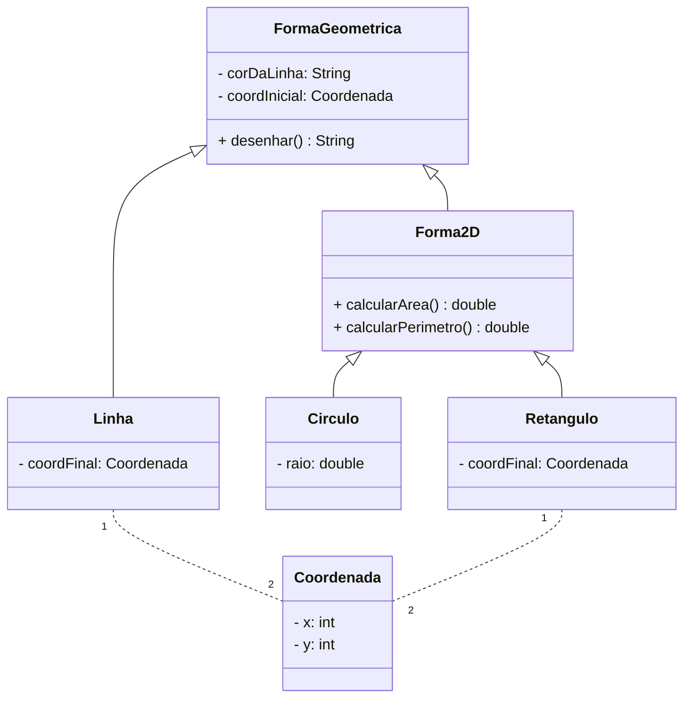

# Modelar aplicativo para desenho vetorial 2d (geometria plana)

Classes:
- Linha
- Círculo
- Retângulo

```mermaid
classDiagram

    class Coordenada {
        - x: int
        - y: int
    }
    
    class FormaGeometrica {
        - corDaLinha: String
        - coordInicial: Coordenada
        + desenhar() String
    }

    class Linha {
        - coordFinal: Coordenada
    }
    
    class Forma2D {
        + calcularArea() double
        + calcularPerimetro() double
    }
    
    class Circulo {
        - raio: double
    }
    
    class Retangulo {
        - coordFinal: Coordenada
    }
    
    FormaGeometrica |>-- Linha
    FormaGeometrica |>-- Forma2D    
    Forma2D |>-- Circulo
    Forma2D |>-- Retangulo
    
    Linha "1".."2" Coordenada
    Retangulo "1".."2" Coordenada
    
    
```