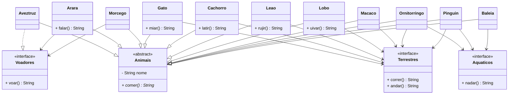

# Animais em um jogo

- Arara, Aveztruz, Baleia, Cachorro, Gato, Leão, Lobo, Macaco, Morcego, Pinguim, Ornittorringo

## Modelagem UML

```mermaid
classDiagram

class Animais {
    <<abstract>>
    - String nome 
    + comer() String*
}

class Voadores {
    <<interface>>
    + voar() String
}

class Terrestres {
    <<interface>>
    + correr() String
    + andar() String
}

class Aquaticos {
    <<interface>>
    + nadar () String
}

class Arara {
    + falar() String
}

class Aveztruz {}

class Cachorro {
    + latir() String
 }

class Gato {
    + miar() String
}

class Leao {
    + rujir() String
}

class Lobo {
    + uivar() String
}

class Macaco {
    
}

class Morcego {
    
}

class Ornitorringo {
    
}

class Pinguin {

}

class Baleia {
    
}


Aveztruz --|> Animais
Arara --|> Animais
Morcego --|> Animais
Gato --|> Animais
Cachorro --|> Animais
Leao --|> Animais
Lobo --|> Animais
Macaco --|> Animais
Ornitorringo --|> Animais
Pinguin --|> Animais
Baleia --|> Animais

Aveztruz ..|> Voadores
Arara --> Voadores
Morcego --> Voadores
Gato --> Terrestres
Cachorro --> Terrestres
Leao --> Terrestres
Lobo --> Terrestres
Macaco --> Terrestres
Ornitorringo --> Aquaticos
Ornitorringo --> Terrestres
Pinguin --> Aquaticos
Pinguin --> Terrestres
Baleia --> Aquaticos
```