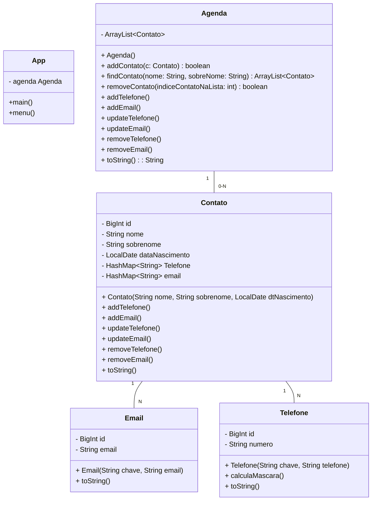

# Agenda telefônica

```mermaid
classDiagram
    directionLR
    
    class App{
        - agenda Agenda
        +main()
        +menu()
    }
    class Agenda{
        - ArrayList~Contato~
        + Agenda()
        + addContato(c: Contato) boolean
        + findContato(nome: String, sobreNome: String) ArrayList~Contato~
        + removeContato(indiceContatoNaLista: int) boolean
        + addTelefone()
        + addEmail()
        + updateTelefone()
        + updateEmail()
        + removeTelefone()
        + removeEmail()
        + toString(): String
    }
    class Contato {
        - BigInt id
        - String nome
        - String sobrenome
        - LocalDate dataNascimento
        - HashMap~String~ Telefone 
        - HashMap~String~ email
        + Contato(String nome, String sobrenome, LocalDate dtNascimento)
        + addTelefone()
        + addEmail()
        + updateTelefone()
        + updateEmail()
        + removeTelefone()
        + removeEmail()
        + toString()
    }
    class Email{
        - BigInt id
        - String email
        + Email(String chave, String email)
        + toString()
    }
    class Telefone{
        - BigInt id
        - String numero
        + Telefone(String chave, String telefone)
        + calculaMascara()
        + toString()
    }
    Agenda "1" -- "0-N" Contato
    Contato "1" -- "N" Email
    Contato "1" -- "N" Telefone
    
```