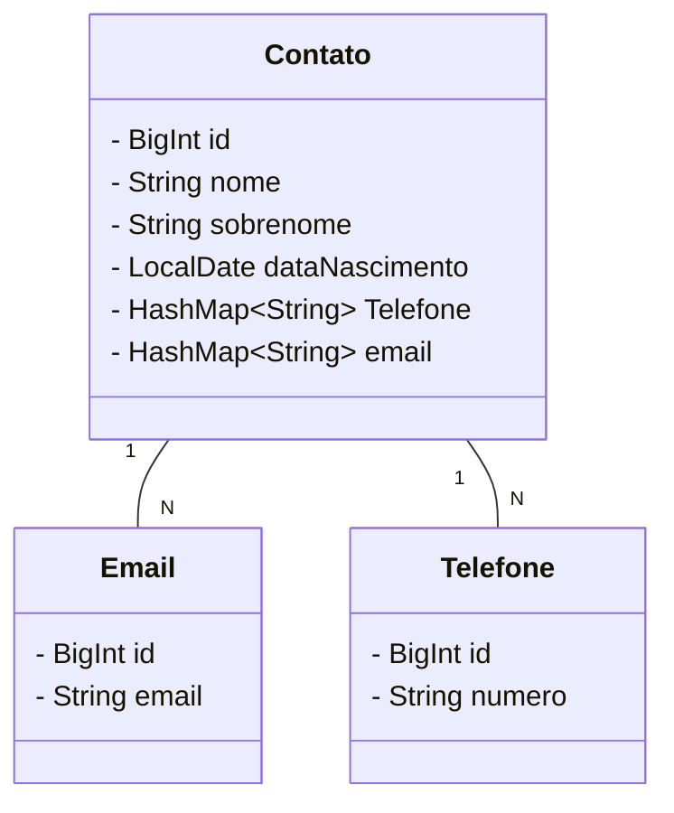

# Agenda telefônica

```mermaid
classDiagram
    directionLR
    
    class Contato {
        - BigInt id
        - String nome
        - String sobrenome
        - LocalDate dataNascimento
        - HashMap~String~ Telefone 
        - HashMap~String~ email
    }
    class Email{
        - BigInt id
        - String email    
    }
    class Telefone{
        - BigInt id
        - String numero    
    }
    Contato "1" -- "N" Email
    Contato "1" -- "N" Telefone
    
```